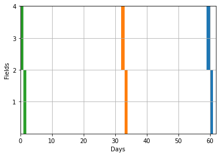

# Minimal Example of MDP Approach to Unified Planting and Harvesting Optimization
This is a minimal implementation of a Markov decision process formulation of the corn planting and harvesting model. This minimal example considers a limited set of fields which to produce corn undergo three different operations: planting, detasseling, and harvesting. Each operation is limited by its own daily capacity, operational time window, and growth degree unit (GDU). It is assumed that harvesting results in a reward of type yield which is a function of GDU at the time of harvest and the field's area. Below, a dynamic programming formulation of the problem is presented:

## Dynamic Programming Framework
**Assumptions**:

    1. Different fields are not batched together
    2. Only one hybrid type is considered
    3. Sequence of operations: Planting --> Detasseling --> Harvesting
    4. Unit of time for each decision epoch is a day
    5. One operation per day on each field
    6. It is assumed if the operation starts on a field, it will be finished by the end of the day
    7. Operations are non-preemptive
    8. GDU evolution is deterministic (by an average of 25 after planting)
    9. Volume yield of a field is a function of GDU at the time of harvest
    10. Fields are not prioritized
    
**Formulation**:

    - Decision epochs: Discrete times for decision making
$$t=0,\ldots,T.$$

    - State space: Summarizes the information neccessary for decision making
$$X:=\Big\{x_t=\{x^i_t\} \text{ where } x^i_t=(GDU^i_t, P^i_t, D^i_t, H^i_t) \text{ for all } i=1,\ldots,F, t=0,\ldots,T\Big\},$$ where $GDU^i_t$ denotes the GDU of field $i$ at time $t$, $P^i_t\in\{0, 1\}$ indicates whether field $i$ is planted by time $t$. $D^i_t$ and $H^i_t$ are also defined in a similar fashion.

    - Action space: Available decisions at each state and decision epoch
$$U_X(x_t):=\Big\{U_t=\{U_{i,j}\}\in\{0, 1\} \text{ for all } i=1,\ldots,F, j\in\{p, d, h\} \text{ subject to } LU_t\leq W \text{ for all }t=0,\ldots,T\Big\},$$ where $U_{i,j}=1$ if operation $j$ is assigned to field $i$. The action space is further restricted by linear constraints which can be viewed in matrix representation as $LU\leq W$. These constraints are:

        1. Daily resource capacities:
$$\sum_{i=1}^{F} U_{i,j}\leq r_j, \qquad\qquad \forall j\in\{p, d, h\},$$ where $r^j$ denotes the daily capacity of resources for operation $j$.

        2. Operational time windowns:
$$U_{i,j} t \leq \overline{T}_j, \qquad\qquad \forall j\in\{p, d, h\},$$
$$U_{i,j} \underline{T}_j \leq t, \qquad\qquad \forall j\in\{p, d, h\},$$ where $\overline{T}_j$ denotes the latest date acceptable for operation $j$ while $\underline{T}_j$ denotes the earliest date.

        3. GDU range limits
$$U_{i, j} GDU^i_t \leq \overline{GDU}_j, \qquad\qquad \forall j\in\{d, h\},$$
$$U_{i, j}\underline{GDU}_j \leq GDU^i_t, \qquad\qquad \forall j\in\{d, h\},$$ where $\overline{GDU}_j$ denotes the highest acceptable GDU for operation $j$ while $\underline{GDU}_j$ denotes the lowest. Also, not that no GDU limits are required for planting since unless a field is planted, its GDU is zero!

        4. Sequence of operations:
$$\begin{align*} &U_{i,p} P^i_t \leq 0, \qquad\qquad &\text { Do not plant field $i$ if already planted, i.e., } P^i_t=1,\\
&U_{i,d} D^i_t \leq 0, \qquad\qquad &\text { Do not detassel field $i$ if already detasseled, i.e., } D^i_t=1,\\
&U_{i,h} H^i_t \leq 0, \qquad\qquad &\text { Do not harvest field $i$ if already planted, i.e., } H^i_t=1,\end{align*}$$
and
$$\begin{align*} &U_{i,d}\leq P^i_t, \qquad\qquad &\text{ Do not detassel field $i$ if not planted,}\\
&U_{i,h} \leq D^i_t, \qquad\qquad &\text{ Do not harvest field $i$ if not detasseled.}\end{align*}$$

        5. One operation per day:
$$\sum_{j\in\{p, d, h\}} U_{i,j} \leq 1, \qquad\qquad \forall i=1,\ldots,F.$$ Note that this constraint is redundant since the sequence of operation ensures that different field operations are done sequentially.


    -Transition: Taking an action in any state results in a transition to another state
$$\begin{equation*} x_{t+1}=\eta\big(x_t, \pi(x_t)\big):=\left\{\begin{array}{l}GDU^i_{t+1}=25(P^i_t-H^i_t)+GDU^i_t\\
P^i_{t+1}=P^i_t+U_{i,p}\\
D^i_{t+1}=D^i_t+U_{i,d}\\
H^i_{t+1}=H^i_t+U_{i,h}
\end{array}\right. \qquad\qquad \forall i=1,\ldots,F,\end{equation*}$$ where $\eta(\cdot)$ is the transition function which identifies the future state $x_{t+1}$ as a function of the current state ${x_t}$ and the current decision $\pi(x_t)$. Note that $\pi(\cdot)$ denotes the decision rule, i.e., policy, which determines the action $U_t$. Also, notice that GDU grows by 25 each day after a field is planted at time $t$ and stops growing once it is harvested. In addition, state variable $P^i_t$ (similarly $D^i_t$ and $H^i_t$) will be equal to 1 once planting (detasseling or harvesting) is started and will remain 1 to the end of the horizon $T$.

    -Immediate reward: Once a field is harvested, an immediate reward of type yield is realized.
$$\begin{equation*} h\big(x_t, \pi(x_t)\big)=\left\{\begin{array}{ll}&0 &\text{ if } U_{i,p}=1,\\
&0 &\text{ if } U_{i,d}=1,\\
&Y(i, x_t) &\text{ if } U_{i,h}=1,
\end{array}\right. \qquad\qquad \forall i=1,\ldots,F,\end{equation*}$$ where $h(\cdot)$ is denotes the immediate reward of taking action $U_t$ under policy $\pi$ at state $x_t$. It ia assumed for this implementation that planting and detasseling do not result in any form of costs, rewards, or utilities. However, once a field is harvested, its yield, i.e., $Y(i, x_t)$, is a function of the area of the field (hence argument $i$) and GDU at the time of harvest (hence argument $x_t$ which contains information about GDU of field $i$ in the form of $GDU^i_t$).

**Optimality Equations**:

The optimal policy is given by solving the following cumulative reward to optimality:
$$V(x_0)=\max_{\pi\in\Pi} \sum_{t=0}^{T} \gamma^{T-t} h\big(x_t, \pi(x_t)\big)$$ where $x_0$ denotes the initial state at time $0$. In this implementation, $x_0=[0]$ which is equivalent to assuming that none of the fields are planted at time $0$. Note that $\Pi$ is the set of admissible policies, and $\gamma$ is the discount factor which is smaller as we reach the end of horizon. In this implementation, $\gamma$ is assumed to be 1.

The recursion to solve this problem is based on Bellman's principle of optimality:

$$\begin{equation*}\begin{array}{ll}&V(x_t)=\max_{U_t\in U_X(x_t)} h(x_t, U_t) + V(x_{t+1}), \qquad\qquad &\forall t=0,\ldots,T,\\
&V(x_{T+1})=0, & \end{array}\end{equation*} $$ where the final reward at time $T+1$ is equal to zero since no operation will be allowed after the end of the horizon.

## Backward Induction Code

Since the reward at the end of the horizon is known, the code belwo recursively calculates $V(x_t)$ by evaluating $V(x_{t+1})$. The number of fields are limited to 4 for this example. After a solution is found, a Gantt chart is ploted to visualize the operations schedule.


```python
#import libraries
import numpy as np
import itertools
%matplotlib inline
import matplotlib.pyplot as plt
```


```python
#install memoization if necessary
#!pip install memoization
from memoization import cached
```

Below, fields are defined. Area of each field is given. It is assumed that the whole operation from planting to harvesting is done within a 60 day period, and earliest and latest acceptable dates as well as lowest and highest acceptable GDUs for each operation are given. 


```python
#define the parameter space
fields=[1, 2, 3, 4]
#fields volumes
area_f=[10, 20, 15, 20]

#horizon
T=60

#earliest & latest possible planting time
EPT=0
LPT=5

#earliest & latest detasseling time
EDT=30
LDT=33

#earliest & latest harvesting time
EHT=58
LHT=60

#lowest & highest detasseling GDU
LgduD=750
HgduD=1000

#lowest & highest harvesting GDU
LgduH=1400
HgduH=1500
```

The state vector is assumed to be constructed of four list elements, i.e., x=[gdu, p, d, h] where, for example, ```len(gdu)==len(fields)```. Below, all permuations of 0 and 1 for $U_t=\{U_{i,j}\}, \forall i=1,\ldots,F, j\in\{p,d,h\}$ are produced at first. Then, infeasible actions are filtered based on state $x_t$ at time $t$ according to the constraints defined above.


```python
#define the action space
def action(x, t):
    #decompose x
    gdu=x[0]
    p=x[1]
    d=x[2]
    h=x[3]
    
    #initialize a set of potential actions. This is the permuation of all 0s and 1s.
    u_p_lst=list(itertools.product([0,1],repeat=4))
    u_d_lst=list(itertools.product([0,1],repeat=4))
    u_h_lst=list(itertools.product([0,1],repeat=4))
    
    #1. Daily resource capacities:
    u_p_lst=[u_p for u_p in u_p_lst if sum(u_p)<=3] #planting reources <=3
    u_d_lst=[u_d for u_d in u_d_lst if sum(u_d)<=2] #detasseling resources <=2
    u_h_lst=[u_h for u_h in u_h_lst if sum(u_h)<=2] #harvesting resources <=2
    
    #2. Operational time windowns:
    u_p_lst=[u_p for u_p in u_p_lst if np.all(np.multiply(u_p, t)<= LPT)] #do not plant later than LPT
    u_p_lst=[u_p for u_p in u_p_lst if np.all(np.multiply(u_p, EPT)<= t)] #do not plant earlier than EPT
    
    u_d_lst=[u_d for u_d in u_d_lst if np.all(np.multiply(u_d, t)<= LDT)] #do not detassel later than LPT
    u_d_lst=[u_d for u_d in u_d_lst if np.all(np.multiply(u_d, EDT)<= t)] #do not detassel earlier than EPT
    
    u_h_lst=[u_h for u_h in u_h_lst if np.all(np.multiply(u_h, t)<= LHT)] #do not detassel later than LPT
    u_h_lst=[u_h for u_h in u_h_lst if np.all(np.multiply(u_h, EHT)<= t)] #do not detassel earlier than EPT
    
    #3. GDU range limits:
    u_d_lst=[u_d for u_d in u_d_lst if np.all(np.multiply(u_d, gdu)<= HgduD)] #do not detassel later than LPT
    u_d_lst=[u_d for u_d in u_d_lst if np.all(np.multiply(u_d, LgduD)<= gdu)] #do not detassel earlier than EPT
    
    u_h_lst=[u_h for u_h in u_h_lst if np.all(np.multiply(u_h, gdu)<= HgduH)] #do not detassel later than LPT
    u_h_lst=[u_h for u_h in u_h_lst if np.all(np.multiply(u_h, LgduH)<= gdu)] #do not detassel earlier than EPT
    
    #4. Sequence of operations:
    u_p_lst=[u_p for u_p in u_p_lst if np.all(np.multiply(u_p, p)<= 0)] #do not plant if already planted
    u_d_lst=[u_d for u_d in u_d_lst if np.all(np.multiply(u_d, d)<= 0)] #do not detassel if already detasseled
    u_h_lst=[u_h for u_h in u_h_lst if np.all(np.multiply(u_h, h)<= 0)] #do not harvest if already harvested
    
    u_d_lst=[u_d for u_d in u_d_lst if np.all(np.array(u_d)<=np.array(p))] #do not detassel if not planted
    u_h_lst=[u_h for u_h in u_h_lst if np.all(np.array(u_h)<=np.array(d))] #do not harvest if not detasseled
    
    #5. One operation per day:
    ##maybe not neccessary because operational sequence constraints do not allow multiple operation in one day
    
    return[u_p_lst, u_d_lst, u_h_lst]
```

Below, the transition function is defined.


```python
#define transition function
def transition(x, u):
    #decompose x, u
    gdu=x[0]
    p=x[1]
    d=x[2]
    h=x[3]
    
    u=[list(i) for i in u] #this is necessary because u is of the form tuple
    u_p=u[0]
    u_d=u[1]
    u_h=u[2]
    
    #transition
    gdu=list(np.array(gdu)+25*(np.array(p)-np.array(h)))
    p=list(np.array(p)+np.array(u_p))
    d=list(np.array(d)+np.array(u_d))
    h=list(np.array(h)+np.array(u_h))
    
    return [gdu, p, d, h]
```

Below, the immediate reward function is defined. It is assumed that maximum yield is only achieved at harvest GDU=1450. In addition, for every 1 unit of GDU difference at the time of harvest, 0.001 of yield is lost.


```python
#define reward
def reward(x, u):
    #decompose x, u
    gdu=x[0]
    p=x[1]
    d=x[2]
    h=x[3]
    
    u=[list(i) for i in u] #this is necessary because u is of the form tuple
    u_p=u[0]
    u_d=u[1]
    u_h=u[2]
    
    reward=sum(np.multiply(np.multiply(area_f, 1-abs(np.array(gdu)-1450)/1000), u_h))
    
    return reward
```

Below, the Bellman's principle of optimiality is implemented. Here, the $V(x_t)$ is kept in memory, ```@cached(max_size=None)``` for every $x_t$ to reduce the number of calculations in the recursion. 


```python
#Bellman's principle
@cached(max_size=None) #memoization
def value_function(x, t):
    #decompose s
    gdu=x[0]
    p=x[1]
    d=x[2]
    h=x[3]
    
    if (t==T+1):
        return 0
    else:
        #get the set of all available actions [(u_p1), (u_d), (u_h)]
        u_set=action(x, t)
        u_set=list(itertools.product(u_set[0], u_set[1], u_set[2]))
        u_set=[list(i) for i in u_set]
        
        return max([reward(x, u)+value_function(transition(x, u), t+1) for u in u_set])
```

Here, $x_0=[0]$ is defined, $t=0$ is set and $V(x_0)$ is evaluated.


```python
#main recursion

#define state variable
gdu=[0,0,0,0]
p=[0,0,0,0]
d=[0,0,0,0]
h=[0,0,0,0]
x=[gdu, p, d, h]
t=0

v_star=value_function(x, t)
```


```python
#optimal value function
v_star
```


    65.0


Here, the optimal action at every time is extracted based on the optimal value of $V(x_t)$.


```python
policy=[]
state_progression=[]
gdu=[0,0,0,0]
p=[0,0,0,0]
d=[0,0,0,0]
h=[0,0,0,0]
x=[gdu, p, d, h]
t=0
for t in range(0, T+1):
    u_set=action(x, t)
    u_set=list(itertools.product(u_set[0], u_set[1], u_set[2]))
    u_set=[list(i) for i in u_set]
    new_value=[]
    new_x=[]
    for u in u_set:
        x_temp=transition(x, u)
        new_x.append(x_temp)
        new_value.append(reward(x, u)+value_function(x_temp, t+1))
    policy.append(u_set[np.argmax(new_value)])
    x=new_x[np.argmax(new_value)]
    state_progression.append(x)
#policy.reverse()
```


```python
policy
#[(u_p), (u_d), (u_h)]
```


    [[(0, 0, 1, 1), (0, 0, 0, 0), (0, 0, 0, 0)],
     [(1, 1, 0, 0), (0, 0, 0, 0), (0, 0, 0, 0)],
     [(0, 0, 0, 0), (0, 0, 0, 0), (0, 0, 0, 0)],
     [(0, 0, 0, 0), (0, 0, 0, 0), (0, 0, 0, 0)],
     [(0, 0, 0, 0), (0, 0, 0, 0), (0, 0, 0, 0)],
     [(0, 0, 0, 0), (0, 0, 0, 0), (0, 0, 0, 0)],
     [(0, 0, 0, 0), (0, 0, 0, 0), (0, 0, 0, 0)],
     [(0, 0, 0, 0), (0, 0, 0, 0), (0, 0, 0, 0)],
     [(0, 0, 0, 0), (0, 0, 0, 0), (0, 0, 0, 0)],
     [(0, 0, 0, 0), (0, 0, 0, 0), (0, 0, 0, 0)],
     [(0, 0, 0, 0), (0, 0, 0, 0), (0, 0, 0, 0)],
     [(0, 0, 0, 0), (0, 0, 0, 0), (0, 0, 0, 0)],
     [(0, 0, 0, 0), (0, 0, 0, 0), (0, 0, 0, 0)],
     [(0, 0, 0, 0), (0, 0, 0, 0), (0, 0, 0, 0)],
     [(0, 0, 0, 0), (0, 0, 0, 0), (0, 0, 0, 0)],
     [(0, 0, 0, 0), (0, 0, 0, 0), (0, 0, 0, 0)],
     [(0, 0, 0, 0), (0, 0, 0, 0), (0, 0, 0, 0)],
     [(0, 0, 0, 0), (0, 0, 0, 0), (0, 0, 0, 0)],
     [(0, 0, 0, 0), (0, 0, 0, 0), (0, 0, 0, 0)],
     [(0, 0, 0, 0), (0, 0, 0, 0), (0, 0, 0, 0)],
     [(0, 0, 0, 0), (0, 0, 0, 0), (0, 0, 0, 0)],
     [(0, 0, 0, 0), (0, 0, 0, 0), (0, 0, 0, 0)],
     [(0, 0, 0, 0), (0, 0, 0, 0), (0, 0, 0, 0)],
     [(0, 0, 0, 0), (0, 0, 0, 0), (0, 0, 0, 0)],
     [(0, 0, 0, 0), (0, 0, 0, 0), (0, 0, 0, 0)],
     [(0, 0, 0, 0), (0, 0, 0, 0), (0, 0, 0, 0)],
     [(0, 0, 0, 0), (0, 0, 0, 0), (0, 0, 0, 0)],
     [(0, 0, 0, 0), (0, 0, 0, 0), (0, 0, 0, 0)],
     [(0, 0, 0, 0), (0, 0, 0, 0), (0, 0, 0, 0)],
     [(0, 0, 0, 0), (0, 0, 0, 0), (0, 0, 0, 0)],
     [(0, 0, 0, 0), (0, 0, 0, 0), (0, 0, 0, 0)],
     [(0, 0, 0, 0), (0, 0, 0, 0), (0, 0, 0, 0)],
     [(0, 0, 0, 0), (0, 0, 1, 1), (0, 0, 0, 0)],
     [(0, 0, 0, 0), (1, 1, 0, 0), (0, 0, 0, 0)],
     [(0, 0, 0, 0), (0, 0, 0, 0), (0, 0, 0, 0)],
     [(0, 0, 0, 0), (0, 0, 0, 0), (0, 0, 0, 0)],
     [(0, 0, 0, 0), (0, 0, 0, 0), (0, 0, 0, 0)],
     [(0, 0, 0, 0), (0, 0, 0, 0), (0, 0, 0, 0)],
     [(0, 0, 0, 0), (0, 0, 0, 0), (0, 0, 0, 0)],
     [(0, 0, 0, 0), (0, 0, 0, 0), (0, 0, 0, 0)],
     [(0, 0, 0, 0), (0, 0, 0, 0), (0, 0, 0, 0)],
     [(0, 0, 0, 0), (0, 0, 0, 0), (0, 0, 0, 0)],
     [(0, 0, 0, 0), (0, 0, 0, 0), (0, 0, 0, 0)],
     [(0, 0, 0, 0), (0, 0, 0, 0), (0, 0, 0, 0)],
     [(0, 0, 0, 0), (0, 0, 0, 0), (0, 0, 0, 0)],
     [(0, 0, 0, 0), (0, 0, 0, 0), (0, 0, 0, 0)],
     [(0, 0, 0, 0), (0, 0, 0, 0), (0, 0, 0, 0)],
     [(0, 0, 0, 0), (0, 0, 0, 0), (0, 0, 0, 0)],
     [(0, 0, 0, 0), (0, 0, 0, 0), (0, 0, 0, 0)],
     [(0, 0, 0, 0), (0, 0, 0, 0), (0, 0, 0, 0)],
     [(0, 0, 0, 0), (0, 0, 0, 0), (0, 0, 0, 0)],
     [(0, 0, 0, 0), (0, 0, 0, 0), (0, 0, 0, 0)],
     [(0, 0, 0, 0), (0, 0, 0, 0), (0, 0, 0, 0)],
     [(0, 0, 0, 0), (0, 0, 0, 0), (0, 0, 0, 0)],
     [(0, 0, 0, 0), (0, 0, 0, 0), (0, 0, 0, 0)],
     [(0, 0, 0, 0), (0, 0, 0, 0), (0, 0, 0, 0)],
     [(0, 0, 0, 0), (0, 0, 0, 0), (0, 0, 0, 0)],
     [(0, 0, 0, 0), (0, 0, 0, 0), (0, 0, 0, 0)],
     [(0, 0, 0, 0), (0, 0, 0, 0), (0, 0, 0, 0)],
     [(0, 0, 0, 0), (0, 0, 0, 0), (0, 0, 1, 1)],
     [(0, 0, 0, 0), (0, 0, 0, 0), (1, 1, 0, 0)]]


```python
state_progression
#[[gdu], [p], [d], [h]]
```


    [[[0, 0, 0, 0], [0, 0, 1, 1], [0, 0, 0, 0], [0, 0, 0, 0]],
     [[0, 0, 25, 25], [1, 1, 1, 1], [0, 0, 0, 0], [0, 0, 0, 0]],
     [[25, 25, 50, 50], [1, 1, 1, 1], [0, 0, 0, 0], [0, 0, 0, 0]],
     [[50, 50, 75, 75], [1, 1, 1, 1], [0, 0, 0, 0], [0, 0, 0, 0]],
     [[75, 75, 100, 100], [1, 1, 1, 1], [0, 0, 0, 0], [0, 0, 0, 0]],
     [[100, 100, 125, 125], [1, 1, 1, 1], [0, 0, 0, 0], [0, 0, 0, 0]],
     [[125, 125, 150, 150], [1, 1, 1, 1], [0, 0, 0, 0], [0, 0, 0, 0]],
     [[150, 150, 175, 175], [1, 1, 1, 1], [0, 0, 0, 0], [0, 0, 0, 0]],
     [[175, 175, 200, 200], [1, 1, 1, 1], [0, 0, 0, 0], [0, 0, 0, 0]],
     [[200, 200, 225, 225], [1, 1, 1, 1], [0, 0, 0, 0], [0, 0, 0, 0]],
     [[225, 225, 250, 250], [1, 1, 1, 1], [0, 0, 0, 0], [0, 0, 0, 0]],
     [[250, 250, 275, 275], [1, 1, 1, 1], [0, 0, 0, 0], [0, 0, 0, 0]],
     [[275, 275, 300, 300], [1, 1, 1, 1], [0, 0, 0, 0], [0, 0, 0, 0]],
     [[300, 300, 325, 325], [1, 1, 1, 1], [0, 0, 0, 0], [0, 0, 0, 0]],
     [[325, 325, 350, 350], [1, 1, 1, 1], [0, 0, 0, 0], [0, 0, 0, 0]],
     [[350, 350, 375, 375], [1, 1, 1, 1], [0, 0, 0, 0], [0, 0, 0, 0]],
     [[375, 375, 400, 400], [1, 1, 1, 1], [0, 0, 0, 0], [0, 0, 0, 0]],
     [[400, 400, 425, 425], [1, 1, 1, 1], [0, 0, 0, 0], [0, 0, 0, 0]],
     [[425, 425, 450, 450], [1, 1, 1, 1], [0, 0, 0, 0], [0, 0, 0, 0]],
     [[450, 450, 475, 475], [1, 1, 1, 1], [0, 0, 0, 0], [0, 0, 0, 0]],
     [[475, 475, 500, 500], [1, 1, 1, 1], [0, 0, 0, 0], [0, 0, 0, 0]],
     [[500, 500, 525, 525], [1, 1, 1, 1], [0, 0, 0, 0], [0, 0, 0, 0]],
     [[525, 525, 550, 550], [1, 1, 1, 1], [0, 0, 0, 0], [0, 0, 0, 0]],
     [[550, 550, 575, 575], [1, 1, 1, 1], [0, 0, 0, 0], [0, 0, 0, 0]],
     [[575, 575, 600, 600], [1, 1, 1, 1], [0, 0, 0, 0], [0, 0, 0, 0]],
     [[600, 600, 625, 625], [1, 1, 1, 1], [0, 0, 0, 0], [0, 0, 0, 0]],
     [[625, 625, 650, 650], [1, 1, 1, 1], [0, 0, 0, 0], [0, 0, 0, 0]],
     [[650, 650, 675, 675], [1, 1, 1, 1], [0, 0, 0, 0], [0, 0, 0, 0]],
     [[675, 675, 700, 700], [1, 1, 1, 1], [0, 0, 0, 0], [0, 0, 0, 0]],
     [[700, 700, 725, 725], [1, 1, 1, 1], [0, 0, 0, 0], [0, 0, 0, 0]],
     [[725, 725, 750, 750], [1, 1, 1, 1], [0, 0, 0, 0], [0, 0, 0, 0]],
     [[750, 750, 775, 775], [1, 1, 1, 1], [0, 0, 0, 0], [0, 0, 0, 0]],
     [[775, 775, 800, 800], [1, 1, 1, 1], [0, 0, 1, 1], [0, 0, 0, 0]],
     [[800, 800, 825, 825], [1, 1, 1, 1], [1, 1, 1, 1], [0, 0, 0, 0]],
     [[825, 825, 850, 850], [1, 1, 1, 1], [1, 1, 1, 1], [0, 0, 0, 0]],
     [[850, 850, 875, 875], [1, 1, 1, 1], [1, 1, 1, 1], [0, 0, 0, 0]],
     [[875, 875, 900, 900], [1, 1, 1, 1], [1, 1, 1, 1], [0, 0, 0, 0]],
     [[900, 900, 925, 925], [1, 1, 1, 1], [1, 1, 1, 1], [0, 0, 0, 0]],
     [[925, 925, 950, 950], [1, 1, 1, 1], [1, 1, 1, 1], [0, 0, 0, 0]],
     [[950, 950, 975, 975], [1, 1, 1, 1], [1, 1, 1, 1], [0, 0, 0, 0]],
     [[975, 975, 1000, 1000], [1, 1, 1, 1], [1, 1, 1, 1], [0, 0, 0, 0]],
     [[1000, 1000, 1025, 1025], [1, 1, 1, 1], [1, 1, 1, 1], [0, 0, 0, 0]],
     [[1025, 1025, 1050, 1050], [1, 1, 1, 1], [1, 1, 1, 1], [0, 0, 0, 0]],
     [[1050, 1050, 1075, 1075], [1, 1, 1, 1], [1, 1, 1, 1], [0, 0, 0, 0]],
     [[1075, 1075, 1100, 1100], [1, 1, 1, 1], [1, 1, 1, 1], [0, 0, 0, 0]],
     [[1100, 1100, 1125, 1125], [1, 1, 1, 1], [1, 1, 1, 1], [0, 0, 0, 0]],
     [[1125, 1125, 1150, 1150], [1, 1, 1, 1], [1, 1, 1, 1], [0, 0, 0, 0]],
     [[1150, 1150, 1175, 1175], [1, 1, 1, 1], [1, 1, 1, 1], [0, 0, 0, 0]],
     [[1175, 1175, 1200, 1200], [1, 1, 1, 1], [1, 1, 1, 1], [0, 0, 0, 0]],
     [[1200, 1200, 1225, 1225], [1, 1, 1, 1], [1, 1, 1, 1], [0, 0, 0, 0]],
     [[1225, 1225, 1250, 1250], [1, 1, 1, 1], [1, 1, 1, 1], [0, 0, 0, 0]],
     [[1250, 1250, 1275, 1275], [1, 1, 1, 1], [1, 1, 1, 1], [0, 0, 0, 0]],
     [[1275, 1275, 1300, 1300], [1, 1, 1, 1], [1, 1, 1, 1], [0, 0, 0, 0]],
     [[1300, 1300, 1325, 1325], [1, 1, 1, 1], [1, 1, 1, 1], [0, 0, 0, 0]],
     [[1325, 1325, 1350, 1350], [1, 1, 1, 1], [1, 1, 1, 1], [0, 0, 0, 0]],
     [[1350, 1350, 1375, 1375], [1, 1, 1, 1], [1, 1, 1, 1], [0, 0, 0, 0]],
     [[1375, 1375, 1400, 1400], [1, 1, 1, 1], [1, 1, 1, 1], [0, 0, 0, 0]],
     [[1400, 1400, 1425, 1425], [1, 1, 1, 1], [1, 1, 1, 1], [0, 0, 0, 0]],
     [[1425, 1425, 1450, 1450], [1, 1, 1, 1], [1, 1, 1, 1], [0, 0, 0, 0]],
     [[1450, 1450, 1475, 1475], [1, 1, 1, 1], [1, 1, 1, 1], [0, 0, 1, 1]],
     [[1475, 1475, 1475, 1475], [1, 1, 1, 1], [1, 1, 1, 1], [1, 1, 1, 1]]]


Below, a Gantt chart is produced based on the optimal $\pi$, i.e., ```policy```. <font color='green'>Green</font> denotes the planting schedule, <font color='orange'>Orange</font> shows the detasseling schedule, and <font color='blue'>Blue</font> shows the harvesting schdule.


```python
def gantt_chart(policy):
    #figure "gnt" 
    fig, gnt = plt.subplots()

    #setting axis limits 
    gnt.set_ylim(0, len(fields)) 
    gnt.set_xlim(0, T+1+1)

    #setting labels for x-axis and y-axis 
    gnt.set_xlabel('Days') 
    gnt.set_ylabel('Fields')

    #ticks and labels on y-axis 
    gnt.set_yticks(fields)
    gnt.set_yticklabels(['1', '2', '3', '4'])

    #setting graph attribute 
    gnt.grid(True)

    for i in range(0, len(policy)):
        u_p=policy[i][0]
        u_d=policy[i][1]
        u_h=policy[i][2]
        if (np.any(np.array(u_p)!=0)):
            for j in range(0, len(fields)):
                if (u_p[j]==1):
                    gnt.broken_barh([(i, 1)], (j, 1), facecolors=('tab:green'))
        if (np.any(np.array(u_d)!=0)):
            for j in range(0, len(fields)):
                if (u_d[j]==1):
                    gnt.broken_barh([(i, 1)], (j, 1), facecolors=('tab:orange'))
        if (np.any(np.array(u_h)!=0)):
            for j in range(0, len(fields)):
                if (u_h[j]==1):
                    gnt.broken_barh([(i, 1)], (j, 1), facecolors=('tab:blue'))
    return fig, gnt
```


```python
gantt_chart(policy)
```


    (<Figure size 432x288 with 1 Axes>,
     <AxesSubplot:xlabel='Days', ylabel='Fields'>)




